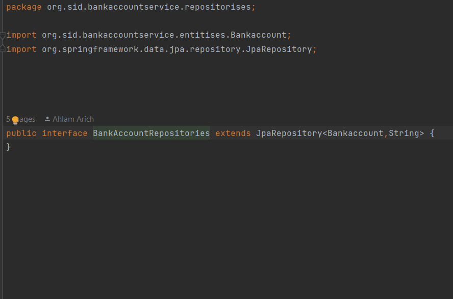
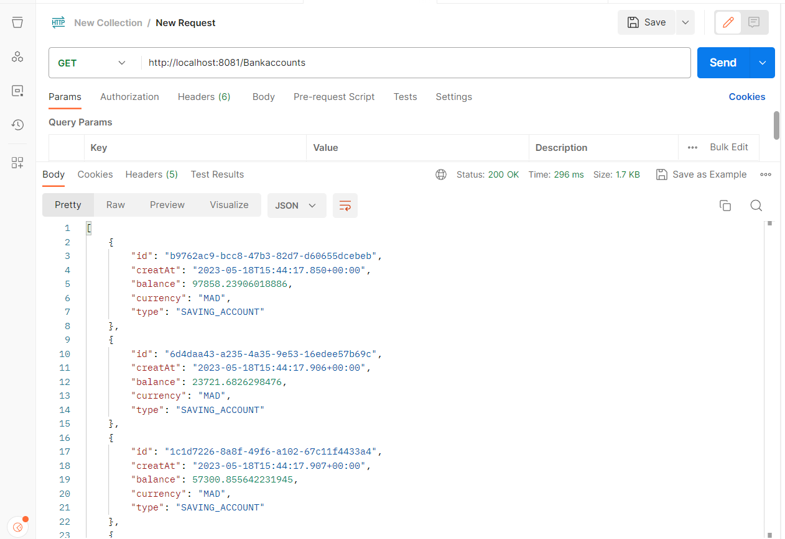

<h3> Compte rendu </h3>

<ol>
  <li>1. Créer un projet Spring Boot avec les dépendances Web, Spring Data JPA, H2, Lombok</li>

  <li>Créer l'entité JPA Compte</li>

<li>Créer l'interface CompteRepository basée sur Spring Data</li>

<li>Tester la couche DAO</li>

<li> Créer le Web service Restfull qui permet de gérer des comptes</li>

<li>Tester le web micro-service en utilisant un client REST comme Postman</li>

<li>Générer et tester le documentation Swagger de des API Rest du Web service</li>
<li>Exposer une API Restful en utilisant Spring Data Rest en exploitant des projections</li>
<li>Créer les DTOs et Mapper</li>
<li>Créer la couche Service (métier) et du micro service</li>

 
</ol>

